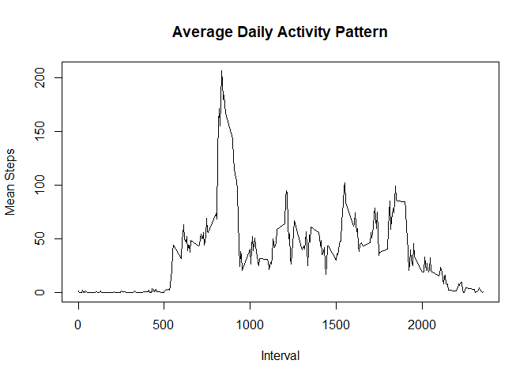
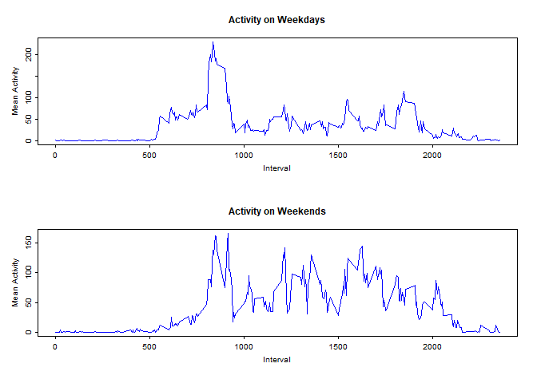

## Loading packages

```r
library(tidyverse)
```

```
## -- Attaching packages ---------------------------------- tidyverse 1.2.1 --
```

```
## v ggplot2 3.2.1     v purrr   0.3.2
## v tibble  2.1.3     v dplyr   0.8.3
## v tidyr   1.0.0     v stringr 1.4.0
## v readr   1.3.1     v forcats 0.4.0
```

```
## -- Conflicts ------------------------------------- tidyverse_conflicts() --
## x dplyr::filter() masks stats::filter()
## x dplyr::lag()    masks stats::lag()
```

```r
library(knitr)
```


## Loading and preprocessing the data

```r
activity <- read.csv("activity.csv")
```


## What is mean total number of steps taken per day?

```r
total_mean <- activity %>%
  group_by(date) %>%
  summarise(total_steps = sum(steps, na.rm = TRUE))

mean <- mean(total_mean$total_steps, na.rm = TRUE)

median <- median(total_mean$total_steps, na.rm = TRUE)

hist(total_mean$total_steps, xlab = "Total Steps", main = "Histogram of Total Steps per Day")
```

<!-- -->

```r
mean
```

```
## [1] 9354.23
```

```r
median
```

```
## [1] 10395
```


## What is the average daily activity pattern?

```r
daily_mean <- activity %>%
  group_by(interval) %>%
  summarise(mean_activity = mean(steps, na.rm = TRUE))

maximum <- daily_mean %>%
  filter(mean_activity == max(daily_mean$mean_activity)) %>%
  select(interval)

plot(daily_mean$interval, daily_mean$mean_activity, type = "l", xlab = "Interval", ylab = "Mean Steps", main = "Average Daily Activity Pattern")
```

<!-- -->

```r
maximum
```

```
## # A tibble: 1 x 1
##   interval
##      <int>
## 1      835
```


## Imputing missing values

```r
x <- is.na(activity)

# Make binary variable if there are NAs or not

nas <- activity %>%
  mutate(is_na = case_when(is.na(steps) == TRUE ~ 1,
                           is.na(date) == TRUE ~ 1,
                           is.na(interval) == TRUE ~ 1,
                           TRUE ~ 0))

total_NA <- sum(nas$is_na)

# Substitute all missing values for the average activity per day
activity2 <- merge(activity, daily_mean, by = "interval", all.x = TRUE, all.y = FALSE)

activity2 <- activity2 %>%
  mutate(daily_steps = case_when(is.na(steps) == TRUE ~ mean_activity,
                                 TRUE ~ as.numeric(steps))) %>%
  select(interval, date, daily_steps)

# Find the mean and median daily steps after imputing missing values
mean2 <- mean(activity2$daily_steps)

median2 <- median(activity2$daily_steps)

total_NA
```

```
## [1] 2304
```

```r
hist(activity2$daily_steps, xlab = "Daily Steps", main = "Histogram of Daily Steps without Missing Values")
```

<!-- -->

```r
mean2
```

```
## [1] 37.3826
```

```r
median2
```

```
## [1] 0
```


## Are there differences in activity patterns between weekdays and weekends?

```r
day <- weekdays(as.Date(activity2$date))

day <- as.data.frame(day)

activity2 <- cbind(activity2, day)

weekday <- activity2[activity2$day != "Sunday" & activity2$day != "Saturday", ]

weekend <- activity2[activity2$day == "Sunday" | activity2$day == "Saturday", ]

weekday_mean <- weekday %>%
  group_by(interval) %>%
  summarise(mean_activity = mean(daily_steps))

weekend_mean <- weekend %>%
  group_by(interval) %>%
  summarise(mean_activity = mean(daily_steps))

par(mfrow = c(2, 1))
par(cex = 0.6)
par(tcl = -0.25)
par(mgp = c(2, 0.6, 0))

plot(weekday_mean$interval, weekday_mean$mean_activity, type = "l", xlab = "Interval", ylab = "Mean Activity", main = "Activity on Weekdays", col = "blue")

plot(weekend_mean$interval, weekend_mean$mean_activity, type = "l", xlab = "Interval", ylab = "Mean Activity", main = "Activity on Weekends", col = "blue")
```

<!-- -->


